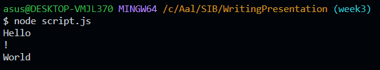
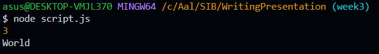
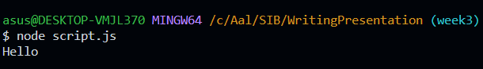

# Javascript Intermediate
## Array
array merupakan kumpulan data yang memiliki tipe yang sama. array dapat menyimpan berbagai macam tipe data seperti string, number, boolean, object, dan lain-lain. array juga dapat menyimpan array lainnya. array dapat diakses dengan menggunakan index. index dimulai dari 0. untuk mengakses array, kita dapat menggunakan tanda kurung siku dan indexnya. contoh:
```js
const array = [1, 2, 3, 4, 5];
console.log(array[0]); // 1
console.log(array[1]); // 2
console.log(array[2]); // 3
console.log(array[3]); // 4
console.log(array[4]); // 5
```
### Array Properties
terdapat 5 properties yang dapat digunakan untuk mengakses array, properti constructor, length, index, input, dan prototype. namun yang akan kita bahas hanya properti length. properti length digunakan untuk mengakses panjang array. 
#### length
length adalah property yang digunakan untuk mengetahui panjang array. contoh:
```js
const array = [1, 2, 3, 4, 5];
console.log(array.length); // 5
```

### Array Methods
terdapat banyak sekali method yang dapat digunakan untuk mengakses array. method-method tersebut dapat digunakan untuk menambah, menghapus, dan mengubah data pada array. method-method tersebut dapat dikelompokkan menjadi 3 kelompok, yaitu method untuk menambah data, method untuk menghapus data, dan method untuk mengubah data. method-method tersebut akan kita bahas satu persatu.
#### push
method push digunakan untuk menambahkan data pada akhir array. contoh:
```js
const array = [1, 2, 3, 4, 5];
array.push(6);
console.log(array); // [1, 2, 3, 4, 5, 6]
```
#### pop
method pop digunakan untuk menghapus data pada akhir array. contoh:
```js
const array = [1, 2, 3, 4, 5];
array.pop();
console.log(array); // [1, 2, 3, 4]
```
#### unshift
method unshift digunakan untuk menambahkan data pada awal array. contoh:
```js
const array = [1, 2, 3, 4, 5];
array.unshift(0);
console.log(array); // [0, 1, 2, 3, 4, 5]
```
#### shift
method shift digunakan untuk menghapus data pada awal array. contoh:
```js
const array = [1, 2, 3, 4, 5];
array.shift();
console.log(array); // [2, 3, 4, 5]
```
#### splice
method splice digunakan untuk menambahkan dan menghapus data pada array. method splice memiliki 3 parameter, yaitu index, deleteCount, dan item. index
adalah index dimana kita akan menambahkan atau menghapus data. deleteCount adalah jumlah data yang akan dihapus. item adalah data yang akan ditambahkan. contoh:
```js
const array = [1, 2, 3, 4, 5];
array.splice(2, 0, 6);
console.log(array); // [1, 2, 6, 3, 4, 5]
```
#### slice
method slice digunakan untuk mengambil data pada array. method slice memiliki 2 parameter, yaitu start dan end. start adalah index dimana kita akan memulai mengambil data. end adalah index dimana kita akan berhenti mengambil data. contoh:
```js
const array = [1, 2, 3, 4, 5];
const newArray = array.slice(2, 4);
console.log(newArray); // [3, 4]
```
#### concat
method concat digunakan untuk menggabungkan 2 array. contoh:
```js
const array1 = [1, 2, 3, 4, 5];
const array2 = [6, 7, 8, 9, 10];
const newArray = array1.concat(array2);
console.log(newArray); // [1, 2, 3, 4, 5, 6, 7, 8, 9, 10]
```
#### join
method join digunakan untuk menggabungkan data pada array menjadi string. method join memiliki 1 parameter, yaitu separator. separator adalah karakter yang akan digunakan untuk memisahkan data pada array. contoh:
```js
const array = [1, 2, 3, 4, 5];
const string = array.join("-");
console.log(string); // 1-2-3-4-5
```
#### reverse
method reverse digunakan untuk membalik urutan data pada array. contoh:
```js
const array = [1, 2, 3, 4, 5];
array.reverse();
console.log(array); // [5, 4, 3, 2, 1]
```
#### sort
method sort digunakan untuk mengurutkan data pada array. contoh:
```js
const array = [5, 4, 3, 2, 1];
array.sort();
console.log(array); // [1, 2, 3, 4, 5]
```
### Array Looping
terdapat 3 cara untuk melakukan looping pada array, yaitu for, for...of, dan forEach, dan juga .map(). cara-cara tersebut akan kita bahas satu persatu.
#### for
for digunakan untuk melakukan looping pada array. contoh:
```js
const array = [1, 2, 3, 4, 5];
for (let i = 0; i < array.length; i++) {
  console.log(array[i]);
}
```
#### for...of
for...of digunakan untuk melakukan looping pada array. contoh:
```js
const array = [1, 2, 3, 4, 5];
for (const item of array) {
  console.log(item);
}
```
#### forEach
forEach digunakan untuk melakukan looping pada setiap elemen array. contoh:
```js
const array = [1, 2, 3, 4, 5];
array.forEach((item) => {
  console.log(item);
});
```
#### .map()
.map() digunakan untuk melakukan looping pada array sesuai dengan sebuah ketentuan tertentu. contoh:
```js
const array = [1, 2, 3, 4, 5];
const newArray = array.map((item) => {
  return item * 2;
});
console.log(newArray); // [2, 4, 6, 8, 10]
```

### Multi Dimensional Array
multi dimensional array adalah array yang berisi array. contoh:
```js
const array = 
    [
    [1, 2, 3], 
    [4, 5, 6], 
    [7, 8, 9]
    ];
```
cara mengakses data pada multi dimensional array adalah dengan menggunakan index. contoh:
```js
const array = 
    [
    [1, 2, 3], 
    [4, 5, 6], 
    [7, 8, 9]
    ];
console.log(array[0][0]); // 1
console.log(array[0][1]); // 2
console.log(array[0][2]); // 3
console.log(array[1][0]); // 4
console.log(array[1][1]); // 5
console.log(array[1][2]); // 6
console.log(array[2][0]); // 7
console.log(array[2][1]); // 8
console.log(array[2][2]); // 9
```
mengapa pemanggilan tersebut berbentuk seperti itu, dimana terdapat 2 index? karena array[0] adalah array pertama, dan array[0][0] adalah data pertama pada array pertama. begitu juga dengan array[1] dan array[2].

## Javascript Object
object adalah sebuah variabel yang memiliki banyak property. contoh:
```js
let object = {
  name: "Aal",
  age: 21,
  address: "Jl. Mul No. 322"
};
```
cara mengakses object adalah dengan menggunakan titik. contoh:
```js
let object = {
  name: "Aal",
  age: 21,
  address: "Jl. Mul No. 322"
};
console.log(object); // {name: "Aal", age: 21, address: "Jl. Mul No. 322"}
```

cara mengakses property pada object adalah dengan menggunakan titik. contoh:
```js
let object = {
  name: "Aal",
  age: 21,
  address: "Jl. Mul No. 322"
};
console.log(object.name); // Aal
console.log(object.age); // 21
console.log(object.address); // Jl. Mul No. 322
```

cara mengubah property pada object bisa kita lakukan dengan cara mendeklarasikan variabel ulang. contoh:
```js
let object = {
  name: "Aal",
  age: 21,
  address: "Jl. Mul No. 322"
};
object = {
    'Khalif'
}
console.log(object); // {name: "Khalif", age: 21, address: "Jl. Mul No. 322"}
```

cara menambahkan property pada object adalah dengan cara mendeklarasikan variabel ulang. contoh:
```js
let object = {
  name: "Aal",
  age: 21,
  address: "Jl. Mul No. 322"
};
object = {
    hobby: "Coding"
}
console.log(object); // {name: "Khalif", age: 21, address: "Jl. Mul No. 322", hobby: "Coding"}
```

cara menghapus property pada object adalah dengan menggunakan delete. contoh:
```js
let object = {
  name: "Aal",
  age: 21,
  address: "Jl. Mul No. 322"
};
delete object.name;
console.log(object); // {age: 21, address: "Jl. Mul No. 322"}
```

### Method
method adalah sebuah function yang berada di dalam object. contoh:
```js
let object = {
  name: "Aal",
  age: 21,
  address: "Jl. Mul No. 322",
  sayHello: function() {
    console.log("Hello");
  }
};
object.sayHello(); // Hello
```

### Object Looping
terdapat 3 cara untuk melakukan looping pada object, yaitu for...in, Object.keys(), dan Object.values(). cara-cara tersebut akan kita bahas satu persatu.
#### for...in
for...in digunakan untuk melakukan looping pada object. contoh:
```js
let object = {
  name: "Aal",
  age: 21,
  address: "Jl. Mul No. 322"
};
for (const key in object) {
  console.log(object[key]);
}
```
#### Object.keys()
Object.keys() digunakan untuk melakukan looping pada object. contoh:
```js
let object = {
  name: "Aal",
  age: 21,
  address: "Jl. Mul No. 322"
};
Object.keys(object).forEach((key) => {
  console.log(object[key]);
});
```
#### Object.values()
Object.values() digunakan untuk melakukan looping pada object. contoh:
```js
let object = {
  name: "Aal",
  age: 21,
  address: "Jl. Mul No. 322"
};
Object.values(object).forEach((value) => {
  console.log(value);
});
```
### Array of Object
array of object adalah sebuah array yang berisi object. contoh:
```js
let array = [
  {
    name: "Aal",
    age: 21,
    address: "Jl. Mul No. 322"
  },
  {
    name: "Khalif",
    age: 21,
    address: "Jl. Mul No. 322"
  }
];
```
cara mengakses data pada array of object adalah dengan menggunakan looping foreach. contoh:
```js
let array = [
  {
    name: "Aal",
    age: 21,
    address: "Jl. Mul No. 322"
  },
  {
    name: "Khalif",
    age: 21,
    address: "Jl. Mul No. 322"
  }
];
array.forEach((item) => {
  console.log(item);
});
```

## Recursion
recursion adalah sebuah function yang memanggil dirinya sendiri sampai sebuah kondisi tertentu. contoh:
```js
function sayHello() {
  console.log("Hello");
  sayHello();
}
sayHello(); // Hello
```
kita bisa menghentikan function tersebut dengan menggunakan kondisi. contoh:
```js
function sayHello(count) {
  if (count === 0) {
    return;
  }
  console.log("Hello");
  sayHello(count - 1);
}
sayHello(5); // Hello
```

## Web Storage
web storage adalah sebuah penyimpanan data pada browser. terdapat 2 jenis web storage, yaitu localStorage dan sessionStorage. localStorage adalah sebuah penyimpanan data yang bersifat permanen, sedangkan sessionStorage adalah sebuah penyimpanan data yang bersifat sementara.
contoh memanipulasi data menggunakan Web Storage:
```js
localStorage.setItem("name", "Aal");
localStorage.setItem("age", 21);
console.log(localStorage.getItem("name")); // Aal
console.log(localStorage.getItem("age")); // 21
localStorage.removeItem("name");
localStorage.removeItem("age");
```

## Asynchronous
asynchronous adalah sebuah function yang tidak menunggu function lain untuk selesai, atau memberikan izin kepada komputer untuk memproses task
yang lain sambil menunggu proses yang masih berlangsung. contoh:
```js
console.log("Hello");
setTimeout(() => {
  console.log("World");
}, 1000);
console.log("!");
```
maka hasilnya akan seperti ini.



### Callback
callback adalah sebuah function yang diberikan sebagai parameter pada function lain. contoh:
```js
function sayHello(a,b,callback) {
    console.log(a + b);
    callback();
  }
  mycall = () => {
    console.log("World");
  };

  sayHello(1,2,mycall);
```
maka hasilnya akan seperti ini.



### Promise
promise adalah sebuah object yang berisi function yang akan dijalankan pada waktu tertentu. contoh:
```js
let promise = new Promise((resolve, reject) => {
  setTimeout(() => {
    resolve("Hello");
  }, 1000);
});
promise.then((value) => {
  console.log(value);
});
```
maka hasilnya akan seperti ini.


hasil diatas muncul setelah 1 detik karena kita menggunakan setTimeout().

### Async/Await
async/await adalah sebuah function yang mempermudah kita untuk melakukan asynchronous. contoh:
```js
async function sayHello() {
  let promise = new Promise((resolve, reject) => {
    setTimeout(() => {
      resolve("Hello");
    }, 1000);
  });
  let result = await promise;
  console.log(result);
}
sayHello();
```

hasil diatas muncul setelah 1 detik karena kita menggunakan setTimeout() pada promise dan await disini berguna untuk menunggu promise selesai.

## Fetch
fetch adalah sebuah function yang digunakan untuk mengambil data dari API. contoh:
```js
fetch("https://jsonplaceholder.typicode.com/users")
  .then((response) => response.json())
  .then((json) => console.log(json));
```


