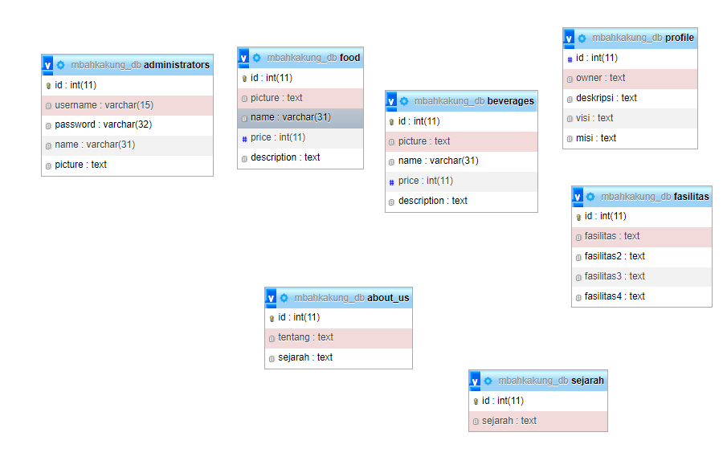
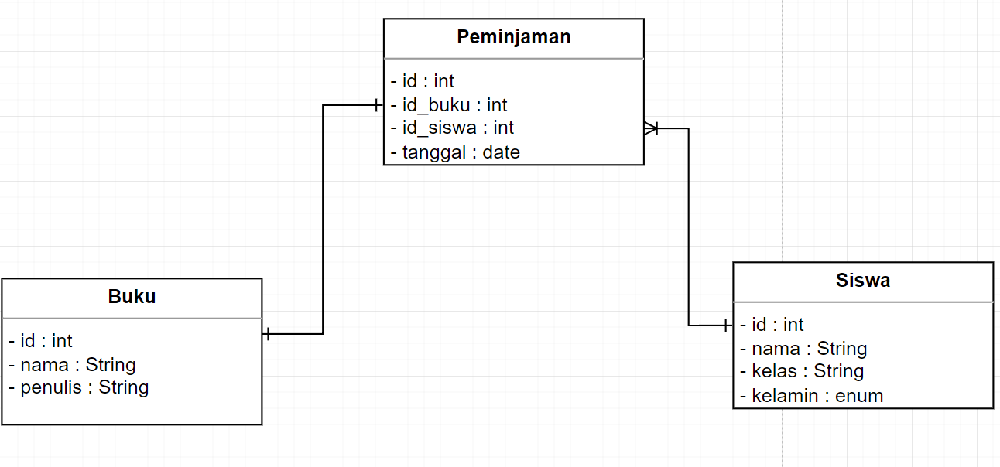

# Web Servers & RESTful APIs
## Web Server
Web server yaitu sebuah program yang berjalan di server dan menerima request dari client. Web server akan mengirimkan response ke client berupa file html, gambar, video, dll. Web server juga dapat mengirimkan response berupa data dalam bentuk json, xml, dll. Web server dapat berjalan di server lokal maupun server cloud. Web server yang paling populer saat ini adalah Apache, Nginx, dan IIS.
1. Server side
    Server side progamming disini berarti yaitu semua yang berhubungan dengan back-end, seperti mengatur pengambilan dan pengiriman data ke database, mengatur routing, dll.
2. Client side
    Client side programming disini berarti yaitu semua yang berhubungan dengan front-end, seperti mengatur tampilan, mengatur event, dll.
3. Server side Framework
    Server side framework adalah sebuah library yang mempermudah kita dalam membuat server side programming. Framework yang paling populer saat ini adalah Express.js, Laravel, dan Django.

## RESTful API
RESTful API / REST API merupakan penerapan dari API (Application Programming Interface). Sedangkan REST (Representional State Transfer) adalah sebuah arsitektur metode komunikasi yang menggunakan protokol HTTP untuk pertukaran data dimana metode ini sering diterapkan dalam pengembangan aplikasi.
1. HTTP Request
    HTTP Request adalah sebuah permintaan yang dikirimkan oleh client ke server. HTTP Request terdiri dari 3 bagian yaitu method, url, dan header.
2. HTTP Response
    HTTP Response adalah sebuah respon yang dikirimkan oleh server ke client. HTTP Response terdiri dari 3 bagian yaitu status code, header, dan body.
3. HTTP Method
    HTTP Method adalah sebuah method yang digunakan untuk melakukan request ke server. HTTP Method yang paling sering digunakan adalah GET, POST, PUT, dan DELETE.

# Node.js
Node.js adalah sebuah runtime environment yang berjalan di server. Node.js menggunakan JavaScript sebagai bahasa pemrogramannya. Node.js dapat digunakan untuk membuat web server, RESTful API, dan aplikasi lainnya.
1. Node.js
    Node.js adalah sebuah runtime environment yang berjalan di server. Node.js menggunakan JavaScript sebagai bahasa pemrogramannya. Node.js dapat digunakan untuk membuat web server, RESTful API, dan aplikasi lainnya.
2. NPM
    NPM adalah sebuah package manager yang digunakan untuk mengelola package-package yang digunakan dalam Node.js. NPM dapat digunakan untuk menginstall, mengupdate, dan menghapus package-package yang digunakan dalam Node.js.
3. Package 
    Package adalah sebuah library yang digunakan dalam Node.js. Package dapat digunakan untuk mempermudah kita dalam membuat aplikasi. Package yang paling populer saat ini adalah Express.js, Body-parser, dan Nodemon.

## Fungsi Node.js bagi Back-end
Fungsi Node.js disini bagi back-end yaitu untuk mengatur routing, mengatur pengambilan dan pengiriman data ke database selain itu juga untuk mengatur event lalu kita juga bisa gunakan Node.js untuk mengirimkan response berupa data dalam bentuk json, xml, dll.

contoh penggunaan node.js untuk back-end
```javascript
const express = require('express')
const app = express()
const port = 3000

app.get('/', (req, res) => {
  res.send('Hello World!')
})

app.listen(port, () => {
  console.log(`Example app listening at http://localhost:${port}`)
})
```
diatas adalah contoh penggunaan node.js untuk back-end yang akan memberikan hasil apabila kita running menggunakan node js di terminal maka akan muncul seperti ini
```javascript
Example app listening at http://localhost:3000
```
dan apabila kita buka browser dan ketikkan http://localhost:3000 maka akan muncul seperti ini
```javascript
Hello World!
```

# Express.js
Express.js adalah sebuah framework yang berjalan di server. Express.js menggunakan JavaScript sebagai bahasa pemrogramannya. Express.js dapat digunakan untuk membuat web server, RESTful API, dan aplikasi lainnya.
1. Routing
    Routing adalah sebuah proses untuk mengatur alamat url yang akan diakses oleh client. Routing dapat digunakan untuk mengatur alamat url yang akan diakses oleh client. Routing yang paling populer saat ini adalah Express.js, Laravel, dan Django.
    contoh penggunaan routing
    ```javascript
    const express = require('express')
    const app = express()
    const port = 3000
    
    app.get('/', (req, res) => {
      res.send('Hello World!')
    })

    app.get('/about', (req, res) => {
      res.send('About Page')
    })

    app.get('/contact', (req, res) => {
      res.send('Contact Page')
    })

    app.listen(port, () => {
      console.log(`Example app listening at http://localhost:${port}`)
    })
    ```
    diatas adalah contoh penggunaan routing yang akan memberikan hasil apabila kita running menggunakan node js di terminal maka akan muncul seperti ini
    ```javascript
    Example app listening at http://localhost:3000
    ```
    dan apabila kita buka browser dan ketikkan http://localhost:3000 maka akan muncul seperti ini
    ```javascript
    Hello World!
    ```
    dan apabila kita buka browser dan ketikkan http://localhost:3000/about maka akan muncul seperti ini
    ```javascript
    About Page
    ```
    dan apabila kita buka browser dan ketikkan http://localhost:3000/contact maka akan muncul seperti ini
    ```javascript
    Contact Page
    ```

2. Middleware
    Middleware adalah sebuah fungsi yang akan dijalankan sebelum routing. Middleware dapat digunakan untuk mengatur event, mengatur tampilan, dll.
    contoh penggunaan middleware
    ```javascript
    const express = require('express')
    const app = express()
    const port = 3000

    app.use((req, res, next) => {
      console.log('Time:', Date.now())
      next()
    })

    app.get('/', (req, res) => {
      res.send('Hello World!')
    })

    app.listen(port, () => {
      console.log(`Example app listening at http://localhost:${port}`)
    })
    ```
    diatas adalah contoh penggunaan middleware yang akan memberikan hasil apabila kita running menggunakan node js di terminal maka akan muncul seperti ini
    ```javascript
    Example app listening at http://localhost:3000
    ```
    dan apabila kita buka browser dan ketikkan http://localhost:3000 maka akan muncul seperti ini
    ```javascript
    Hello World!
    ```
    dan kegunaan dari listen diatas yaitu untuk menampilkan waktu saat kita mengakses halaman tersebut
    dan hasilnya akan seperti ini
    ```javascript
    Time: 1622020000000
    ```

# Design Database with MySQL
## Database
Database adalah sebuah kumpulan data yang disimpan dalam sebuah sistem komputer. Database dapat digunakan untuk menyimpan data-data yang akan digunakan dalam aplikasi. Database yang paling populer saat ini adalah MySQL, PostgreSQL, dan MongoDB.
## MySQL
MySQL adalah sebuah database yang berjalan di server. MySQL menggunakan SQL sebagai bahasa pemrogramannya. MySQL dapat digunakan untuk menyimpan data-data yang akan digunakan dalam aplikasi.
## Design Database
Design database adalah sebuah proses untuk merancang database yang akan digunakan dalam aplikasi. Design database dapat digunakan untuk merancang database yang akan digunakan dalam aplikasi. Design database yang paling populer saat ini adalah MySQL, PostgreSQL, dan MongoDB.

## Menentukan dan membuat diagram, attribute dan relasi entity
berikut merupakan contoh pembuatan database penggunaan mysql


berikut merupakan contoh pembuatan database dengan menggunakan study case
Study casenya:
Sebuah perpustakaan memiliki banyak buku, buku tersebut dapat dipinjam oleh para siswanya, 1 buku hanya dapat dipinjam oleh 1 siswa, namun siswa dapat meminjam banyak buku, dan setiap siswa memiliki banyak data diri seperti nama, dan kelas.
bentuk diagramnya seperti ini

disini relasinya yaitu 1 buku hanya dapat dipinjam oleh 1 siswa, namun 1 siswa dapat melakukan banyak peminjaman buku.