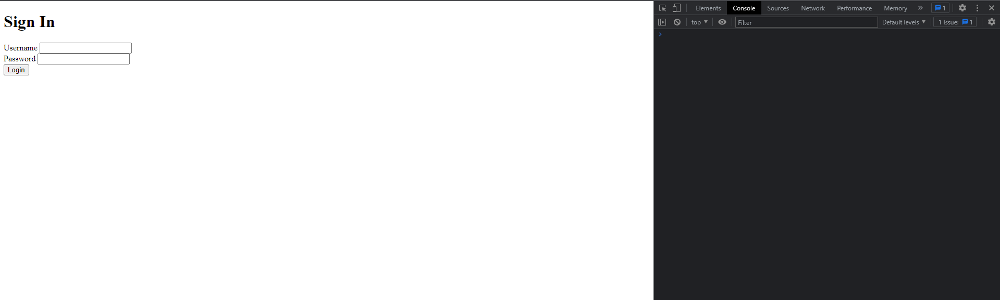
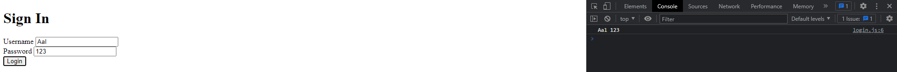
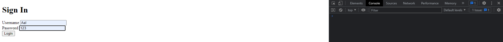
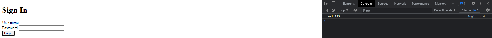

# Javascript Dasar
## **Javascript Scope and Function**
### **Javascript Scope**
Dalam javascript terdapat beberapa scope yang dapat digunakan untuk menentukan variabel mana saja yang dapat diakses oleh kode javascript. Scope yang ada pada javascript adalah: 
1. Global Scope : Global scope merupakan flow data variabel yang dapat digunakan dimanapun dalam sebuah file, untuk membuat sebuah variabel global kita dapat menggunakan keyword `var` atau `let` atau `const` di luar sebuah function. Contoh seperti berikut:

    ```javascript
    var nama = Aal;
    
    function getName() {
        console.log(nama);
    }
    ```
    diatas merupakan sebuah kode dimana kita telah membuat sebuah variabel global dengan nama `nama` dan kita telah membuat sebuah function dengan nama `getName` yang akan mencetak variabel `nama` yang telah kita buat sebelumnya.

2. Local Scope : Local scope merupakan flow data variabel yang dapat digunakan hanya didalam sebuah function saja, dimana kita melakukan pendeklarasian variabel tersebut. Contohnya seperti berikut:

    ```javascript
    function getName() {
    var nama = Aal;
    console.log(nama);
    }
    ```
    diatas merupakan sebuah kode dimana kita telah membuat sebuah variabel local dengan nama `nama` dan kita telah membuat sebuah function dengan nama `getName` yang akan mencetak variabel `nama` yang telah kita buat sebelumnya.

3. Block Scope : Block scope merupakan flow data variabel yang dapat digunakan hanya didalam sebuah block saja, dimana kita melakukan pendeklarasian variabel tersebut. Contohnya seperti berikut:
    ```javascript
    if (true) {
        var nama = Aal;
    }
    console.log(nama);
    ```
    diatas merupakan sebuah kode dimana kita telah membuat sebuah variabel block dengan nama `nama` dan kita telah membuat sebuah block if yang akan mencetak variabel `nama` yang telah kita buat sebelumnya.

### **Javascript Function**
Function merupakan blok kode dalam sebuah yang bisa kita gunakan untuk menyelesaikan 1 tugas atau juga merupakan sebuah 1 fitur dalam sebuah program, dan function ini bisa digunakan berulang ulang. Function pada javascript dapat dibuat dengan menggunakan keyword `function`. Contoh seperti berikut:
```javascript
function getName() {
    console.log("Aal");
}
```
diatas merupakan sebuah kode dimana kita telah membuat sebuah function dengan nama `getName` yang akan mencetak sebuah string `Aal` ketika function tersebut dipanggil. Kemudian contoh pemanggilan dari function tersebut bisa kita lakukan seperti berikut :
```javascript
getName(); // Aal
```
diatas merupakan sebuah kode dimana kita telah memanggil function `getName` yang telah kita buat sebelumnya

#### **Javascript Function Parameter & Argumen**
1. Parameter, Parameter merupakan 
sebuah variabel yang digunakan untuk menampung data yang akan dikirimkan ke function ketika function tersebut dipanggil.
2. Argumen, Argumen merupakan data yang akan dikirimkan ke function ketika function tersebut dipanggil.

Contoh dari parameter dan argumen yaitu seperti berikut:
```javascript
function getName(nama) {
    console.log(nama);
}

getName("Aal"); // Aal
```
diatas merupakan sebuah kode dimana kita telah membuat sebuah function dengan nama `getName` yang memiliki sebuah parameter dengan nama `nama` dan kita telah memanggil function `getName` yang telah kita buat sebelumnya dengan mengirimkan sebuah argumen dengan nama.

#### **Javascript Error & Debugging**
1. Error, Error merupakan sebuah pesan yang akan muncul ketika terjadi kesalahan pada kode javascript yang kita buat. Contoh :
    ```javascript
    function getName(nama) {
        console.log(nama);
    }

    getName(); // Uncaught TypeError: getName is not a function
    ```
    diatas merupakan sebuah kode dimana kita telah membuat sebuah function dengan nama `getName` yang memiliki sebuah parameter dengan nama `nama` dan kita telah memanggil function `getName` yang telah kita buat sebelumnya tanpa mengirimkan sebuah argumen dengan nama.

2. Debugging, Debugging merupakan sebuah proses untuk menemukan dan memperbaiki kesalahan pada kode javascript yang kita buat. Contoh:
    kita dapat melakukan percobaan dengan menggunakan contoh yang sudah diberikan diatas pada bagian error, caranya adalah dengan menambahkan sebuah argumen pada function `getName` yang telah kita buat sebelumnya, contoh seperti berikut:
    ```javascript
    function getName(nama) {
        console.log(nama);
    }
    getName("Aal"); // Aal
    ```
    diatas merupakan contoh pemberaikan dari error yang telah kita temukan sebelumnya.

## Data Type Built in Prototype & Method
### **Javascript Data Type**
1. String, String merupakan sebuah tipe data yang digunakan untuk menyimpan data berupa teks. Contoh :
    ```javascript
    var nama = "Aal";
    ```
    diatas merupakan sebuah kode dimana kita telah membuat sebuah variabel dengan nama `nama` yang memiliki sebuah tipe data string dengan nilai `Aal`.
2. Number, Number merupakan sebuah tipe data yang digunakan untuk menyimpan data berupa angka. Contoh :
    ```javascript
    var umur = 21;
    ```
    diatas merupakan sebuah kode dimana kita telah membuat sebuah variabel dengan nama `umur` yang memiliki sebuah tipe data number dengan nilai `21`.
3. Boolean, Boolean merupakan sebuah tipe data yang digunakan untuk menyimpan data berupa nilai true atau false. Contoh :
    ```javascript
    var isMarried = false;
    ```
4. Math, Math merupakan sebuah built-in object didalam javascript yang dapat kita gunakan untuk melakukan operasi matematika. Contoh :
    ```javascript
    var angka = Math.random();
    console.log(angka);
    ```
    diatas merupakan sebuah kode dimana kita telah membuat sebuah variabel dengan nama `angka` yang memiliki sebuah tipe data number dengan nilai random dari 0 sampai 1.
5. Primitive & Non-Primitive
    1.Primtive adalah tipe data yang tidak memiliki method dan tidak bisa kita tambahkan method didalamnya. berikut merupakan beberapa tipe data
    primitive : Number,Strings, Boolean, Undefined, Null.
    2.Non-Primitive adalah tipe data yang memiliki method dan bisa kita tambahkan method didalamnya namun. berikut merupakan beberapa tipe data
    non-primtive : Array, Object, Function.

## **DOM**
DOM merupakan sebuah singkatan dari Document Object Model, dimana DOM merupakan sebuah interface yang digunakan untuk mengakses dan memanipulasi elemen HTML. DOM ini merupakan sebuah tree yang terdiri dari 3 bagian yaitu :
1. Document, Document merupakan sebuah bagian dari DOM yang merupakan sebuah root dari DOM tree.
2. Element, Element merupakan sebuah bagian dari DOM yang merupakan sebuah node yang berisi elemen HTML.
3. Attribute, Attribute merupakan sebuah bagian dari DOM yang merupakan sebuah node yang berisi atribut dari elemen HTML.
### **DOM Manipulation**
DOM Manipulation merupakan sebuah proses untuk mengubah atau memanipulasi elemen HTML menggunakan javascript. Contoh :
disini saya mencoba menggunakan form seperti yang dibawah ini :
```html
<!DOCTYPE html>
<html lang="en">
<head>
    <meta charset="UTF-8">
    <meta http-equiv="X-UA-Compatible" content="IE=edge">
    <meta name="viewport" content="width=device-width, initial-scale=1.0">
    <title>Document</title>

    <script src="login.js" defer></script>
</head>
<body>
    <div class="container">
        <form id="sign-in">
            <h1>Sign In</h1>
            <div class="field">
                <label for="username">Username</label>
                <input type="text" id="username" name="username" />
            </div>

            <div class="field">
                <label for="password">Password</label>
                <input type="text" id="password" name="password" />
            </div>

            <button type="submit">Login</button>
        </form>
    </div>
</body>
</html>
```

berikut merupakan hasilnya beserta disebelahnya bagian console pada browser.

kemudian saya membuat file baru yang diberi nama `login.js` dan saya menambahkan kode berikut :
```javascript
const form = document.getElementById("sign-in");    
form.addEventListener("submit", function (event) {
    event.preventDefault();
    const username = document.getElementById("username").value;
    const password = document.getElementById("password").value;
    console.log(username, password); 
});
```
diatas merupakan sebuah kode dimana kita telah membuat sebuah variabel dengan nama `form` yang memiliki sebuah value berupa element HTML dengan id `sign-in` dan kita telah menambahkan sebuah event listener pada element HTML dengan id `sign-in` yang memiliki sebuah event `submit` dan kita telah membuat sebuah function yang memiliki sebuah parameter dengan nama `event` dan kita telah memanggil function `preventDefault` yang berfungsi untuk mencegah sebuah event default dari sebuah element HTML yang telah kita buat sebelumnya dan kita telah membuat sebuah variabel dengan nama `username` yang memiliki sebuah value berupa element HTML dengan id `username` dan kita telah memanggil function `value` yang berfungsi untuk mengambil value dari sebuah element HTML yang telah kita buat sebelumnya dan kita telah membuat sebuah variabel dengan nama `password` yang memiliki sebuah value berupa element HTML dengan id `password` dan kita telah memanggil function `value` yang berfungsi untuk mengambil value dari sebuah element HTML yang telah kita buat sebelumnya dan kita telah memanggil function `console.log` yang berfungsi untuk menampilkan sebuah value pada console browser.
<br></br>

kemudian apabila saya coba melakukan submit pada form yang telah saya buat, dengan username Aal dan password 123 maka hasilnya pada bagian form akan menjadi seperti ini :

Kegunaan dari Code diatas yaitu kita mengambil isi dari value yang ada didalam form lalu kita masukkan kedalam sebuah variabel dan kita tampilkan kedalam console browser dengan menggunakan function `console.log`, dan kita juga melakukan pencegahan dari sebuah event default yang terjadi pada sebuah element HTML dengan menggunakan function `preventDefault`, setelah itu semua hal tersebut akan terjadi apabila kita telah melakukan submit pada form yang telah dibuat tadi.

Lalu kita juga bisa menambahkan code berikut didalam function `submit` yang telah kita buat sebelumnya, dibawah console.log :
```javascript
form.reset();
```
Code diatas berfungsi untuk menghapus isi dari value yang ada didalam form.
maka bentuk kode pada bagian js nya akan menjadi seperti ini :
```javascript
const form = document.getElementById("sign-in");    
form.addEventListener("submit", function (event) {
    event.preventDefault();
    const username = document.getElementById("username").value;
    const password = document.getElementById("password").value;
    console.log(username, password);

    form.reset();
}); 
```
apabila kita melakukan percobaan maka hasilnya akan seperti berikut:


diatas merupakan hasil dari form yang telah direset, setelah kita memasukkan username dan password lalu melakukan submit, maka form akan terreset dan hasilnya apakah data tersebut berhasil dimasukkan atau tidak berhasil bisa kita lihat melewati console pada browser.


