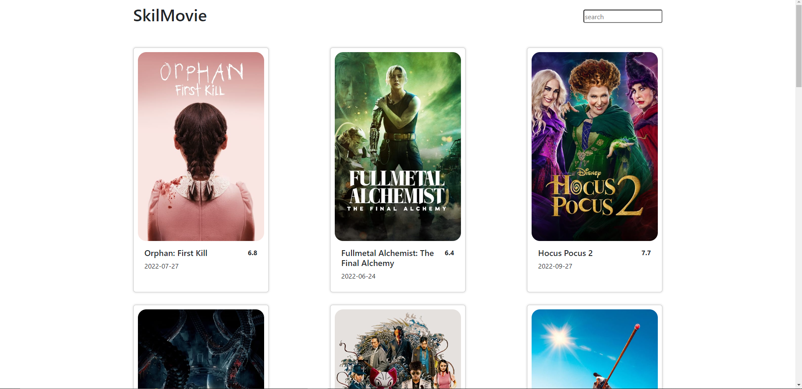
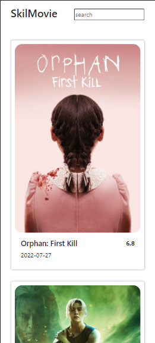

# Javascript Intermediate
## Asynchronous Javascript
### Fetch
Fetch merupakan sebuah API yang digunakan untuk mengambil data dari server. Fetch merupakan sebuah promise yang mengembalikan sebuah response. Response merupakan sebuah promise yang mengembalikan sebuah blob, json, atau text. Fetch juga memiliki method-method lain seperti .then(), .catch(), dan .finally(). Contoh Penggunaan Fetch :
```javascript
fetch('https://jsonplaceholder.typicode.com/users')
  .then(response => response.json())
  .then(json => console.log(json))
```
### Async Await
Await hanya bisa digunakan di dalam function yang memiliki async, dan await disini berguna untuk melakukan proses asynchronous secara berurutan.
Contoh penggunaan Await : 
```javascript
async function getUsers() {
  const response = await fetch('https://jsonplaceholder.typicode.com/users')
  const data = await response.json()
  console.log(data)
}
```
### Promise
Promise merupakan sebuah object yang digunakan untuk menangani proses asynchronous. Promise memiliki 3 state yaitu pending, fulfilled, dan rejected. Promise juga memiliki method-method seperti .then(), .catch(), dan .finally().
Contoh penggunaan Promise :
```javascript
const promise = new Promise((resolve, reject) => {
  if (true) {
    resolve('Stuff Worked')
  } else {
    reject('Error, it broke')
  }
})
```
# Git & Github Lanjutan
Git & Github wajib untuk digunakan dikarenakan git merupakan sebuah version control system yang digunakan untuk mengelola source code. Git juga memiliki beberapa command yang bisa digunakan untuk mengelola source code sedangkan Github merupakan sebuah website yang digunakan untuk menyimpan source code yang sudah di push ke dalam git.

## Alur Kerja dalam Git
1. Membuat repository di Github
2. Clone repository di Github ke dalam local
3. Membuat file baru
4. Menambahkan file baru ke dalam staging area
5. Commit file baru ke dalam local repository
6. Push file baru ke dalam Github
7. Membuat branch baru
8. Checkout ke dalam branch baru
9. Membuat file baru di dalam branch baru
10. Menambahkan file baru ke dalam staging area
11. Commit file baru ke dalam local repository
12. Push file baru ke dalam Github
13. Merge branch baru ke dalam branch master
14. Push branch master ke dalam Github
15. Membuat pull request
16. Merge pull request

## Membuat repository Git
kita dapat menggunakan command berikut untuk membuat repository git :
```bash
git init
```
## Membuat file baru
kita dapat menggunakan command berikut untuk membuat file baru :
```bash
touch README.md
```
## Menambahkan file baru ke dalam staging area
kita dapat menggunakan command berikut untuk menambahkan file baru ke dalam staging area :
```bash
git add README.md
```
## Commit file baru ke dalam local repository
kita dapat menggunakan command berikut untuk commit file baru ke dalam local repository :
```bash
git commit -m "Initial Commit"
```
## Push file baru ke dalam Github
kita dapat menggunakan command berikut untuk push file baru ke dalam Github :
```bash
git push origin master
```
## Melakukan Merge pada Git
kita dapat menggunakan command berikut untuk melakukan merge pada git :
```bash
git merge branch-baru
```
## Menyelesaikan Merge Conflict
kita dapat menggunakan command berikut untuk menyelesaikan merge conflict dengan cara menghapus kode yang tidak diperlukan setelah melakukan merge kemudian melakukan commit dan push:
```bash
git add .
git commit -m "Menyelesaikan Merge Conflict"
git push origin master
```
## Melakukan Cloning ke Local Repository
kita dapat menggunakan command berikut untuk melakukan cloning ke local repository :
```bash
git clone "link-repository"
```

# Responsive Web Design
Responsive web Design yaitu merupakan sebuah design yang dapat menyesuaikan dengan ukuran layar yang digunakan. Responsive web design menggunakan media query untuk menyesuaikan ukuran layar yang digunakan. Media query menggunakan 3 parameter yaitu min-width, max-width, dan orientation. 

## ViewPort
ViewPort merupakan sebuah tag yang digunakan untuk menyesuaikan ukuran layar yang digunakan. ViewPort memiliki 3 parameter yaitu width, height, dan initial-scale.
Contoh penggunaan Viewport :
```html
<meta name="viewport" content="width=device-width, initial-scale=1.0">
```
## Relative CSS Unit
Relative CSS Unit merupakan sebuah unit yang digunakan untuk menyesuaikan ukuran layar yang digunakan. Relative CSS Unit memiliki 4 parameter yaitu em, rem, vw, dan vh.
Contoh penggunaan Relative CSS Unit :
```css
body {
  font-size: 62.5%;
}
h1 {
  font-size: 2em;
}
```

## Pengertian dari Tools yang dapat digunakan dalam Responsive Web Design
1. Flexbox
Flexbox merupakan sebuah property yang digunakan untuk membuat layout yang responsive. Flexbox memiliki 3 parameter yaitu flex-direction, flex-wrap, dan justify-content.
2. Grid
Grid merupakan sebuah property yang digunakan untuk membuat layout yang responsive. Grid memiliki 3 parameter yaitu grid-template-columns, grid-template-rows, dan grid-gap.
3. Media Query
Media Query merupakan sebuah property yang digunakan untuk menyesuaikan ukuran layar yang digunakan. Media Query memiliki 3 parameter yaitu min-width, max-width, dan orientation.

## Contoh Penggunaan Tools yang Digunakan untuk membuat Responsive Web Design
1. Flexbox
Contoh Penggunaan Flexbox:
```css
.container {
  display: flex;
  flex-direction: row;
  justify-content: center;
  align-items: center;
}
```
diatas merupakan contoh penggunaan flexbox untuk membuat container yang memiliki flex-direction row atau dibuat sehingga dia berbentu baris yaitu kebawah, justify-content center atau content ditempatkan ketengah, dan align-items center atau diarahkan elemen-elemen tersebut di tengah.

2. Grid
Contoh Penggunaan Grid:
```css
.container {
  display: grid;
  grid-template-columns: 1fr 1fr 1fr;
  grid-template-rows: 1fr 1fr 1fr;
}
```
diatas merupakan contoh penggunaan grid dengan 3 kolom dan 3 baris.

3. Media Query
Contoh Penggunaan Media Query:
```css
@media (max-width: 600px) {
  .container {
    display: flex;
    flex-direction: column;
    justify-content: center;
    align-items: center;
  }
}
```
diatas merupakan contoh penggunaan media query untuk membuat container menjadi arah flex tersebut menjadi sebuah column atau kepinggir, justify-content center atau content dibuat untuk di tengah, dan align-items center atau diarahkan elemen-elemen tersebut di tengah ketika ukuran layar dibawah 600px.

# Bootstrap
Bootstrap merupakan sebuah framework yang digunakan untuk membuat website yang responsive. Bootstrap memiliki 3 parameter yaitu grid, component, dan utility. Mengapa kita menggunakan bootstrap? Karena bootstrap memiliki banyak sekali component yang dapat digunakan untuk membuat website yang responsive, serta kapan kita menggunakan Bootstrap? Kita dapat menggunakan bootstrap ketika kita ingin membuat website yang responsive dan juga dinamis

## Layout Pada Bootstrap
Layout pada bootstrap memiliki 12 kolom yang dapat digunakan untuk membuat website yang responsive. Layout pada bootstrap memiliki 3 parameter yaitu container, row, dan column. Container digunakan untuk membuat container yang berisi row dan column, row digunakan untuk membuat baris yang berisi column, dan column digunakan untuk membuat kolom yang berisi content.

## Component Pada Bootstrap
Component pada bootstrap memiliki banyak sekali component yang dapat digunakan untuk membuat website yang responsive. Component pada bootstrap memiliki 3 parameter yaitu navbar, card, dan button. Navbar digunakan untuk membuat navbar yang berisi menu-menu, card digunakan untuk membuat card yang berisi content, dan button digunakan untuk membuat button yang berisi text.
Contoh Penggunaan Component pada Boostrap:
```html
<div class="card" style="width: 18rem;">
  
  <div class="card-body">
    <h5 class="card-title">Card title</h5>
    <p class="card-text">Some quick example text to build on the card title and make up the bulk of the card's content.</p>
    <a href="#" class="btn btn-primary">Go somewhere</a>
  </div>
</div>
```
diatas merupakan contoh penggunaan component pada bootstrap yaitu card yang berisi content.

## Utility Pada Bootstrap
Utility pada bootstrap memiliki banyak sekali utility yang dapat digunakan untuk membuat website yang responsive. Utility pada bootstrap memiliki 3 parameter yaitu margin, padding, dan text. Margin digunakan untuk membuat margin pada content, padding digunakan untuk membuat padding pada content, dan text digunakan untuk membuat text pada content.
Contoh Penggunaan Utility pada Boostrap:
```html
<p class="text-center">Center aligned text on all viewport sizes.</p>
```
diatas merupakan contoh penggunaan utility pada bootstrap yaitu text yang berisi content.

## Content Pada Bootstrap
Content pada bootstrap memiliki banyak sekali content yang dapat digunakan untuk membuat website yang responsive. Content pada bootstrap memiliki 3 parameter yaitu image, table, dan form. Image digunakan untuk membuat image pada content, table digunakan untuk membuat table pada content, dan form digunakan untuk membuat form pada content.
Contoh Penggunaan Content pada Boostrap:
```html
<form>
  <div class="form-group">
    <label for="exampleInputEmail1">Email address</label>
    <input type="email" class="form-control" id="exampleInputEmail1" aria-describedby="emailHelp">
    <small id="emailHelp" class="form-text text-muted">We'll never share your email with anyone else.</small>
  </div>
  <div class="form-group
    <label for="exampleInputPassword1">Password</label>
    <input type="password" class="form-control" id="exampleInputPassword1">
    </div>
    <div class="form-group form-check">
        <input type="checkbox" class="form-check-input" id="exampleCheck1">
        <label class="form-check-label" for="exampleCheck1">Check me out</label>
    </div>
    <button type="submit" class="btn btn-primary">Submit</button>
</form>
```
diatas merupakan contoh penggunaan content pada bootstrap yaitu form yang berisi content yang terdapat beberapa input type, ada yang berisi text untuk email kemudian ada password dan ada juga checkbox.

### Contoh Penggunaan Website Responsive Menggunakan Bootstrap
Contoh Penggunaan Website Responsive Menggunakan Bootstrap:

diatas merupakan contoh penggunaan website responsive menggunakan bootstrap dalam bentuk desktop.
kemudian untuk bentuk mobile itu seperti berikut:
<br>


Berikut merupakan CSS yang digunakan untuk membuat website tersebut responsive:
```css
@media screen and (min-width: 600px) {
    #content-title{
        display: flex;
        justify-content: space-between;
        margin-top: 1em;
        margin-bottom: 2em;
        padding-left: 15px;
        padding-right: 15px;
    }
    
    #carifilm{
        height: 2em;
        align-self: center;
        border-radius: 4px;
    }
    
    button{
        border-radius: 15px;
    }
    #card-container{
        display: flex;
        flex-wrap: wrap;
        justify-content:space-between ;
        padding: 0;
    
    }    
    
    .card{
        width: 25%;
        margin: 15px;
        padding: 10px;
        border: 1px solid #ccc;
        border-radius: 5px;
        box-shadow: 0 0 5px #ccc;
    }
    
    .card img{
        width: 100%;
        height: auto;
        object-fit: cover;
        border-radius: 20px;
    }
    
    .card-body{
        display: flex;
        justify-content: space-between;
    }
    
    .vote{
        font-weight: bolder;
    }
}
    
@media screen and (max-width: 600px) {
    #content-title{
        display: flex;
        justify-content: space-between;
        margin-top: 1em;
        margin-bottom: 2em;
        padding-left: 15px;
        padding-right: 15px;
    }
    
    #carifilm{
        height: 2em;
        align-self: center;
        border-radius: 4px;
    }
    
    button{
        border-radius: 15px;
    }
    #card-container{
        display: flex;
        flex-wrap: wrap;
        justify-content:space-between ;
        padding: 0;
    
    }    
    
    .card{
        width: 100%;
        margin: 15px;
        padding: 10px;
        border: 1px solid #ccc;
        border-radius: 5px;
        box-shadow: 0 0 5px #ccc;
    }
    
    .card img{
        width: 100%;
        height: auto;
        object-fit: cover;
        border-radius: 20px;
    }
    
    .card-body{
        display: flex;
        justify-content: space-between;
    }
    
    .vote{
        font-weight: bolder;
    }
}
```


